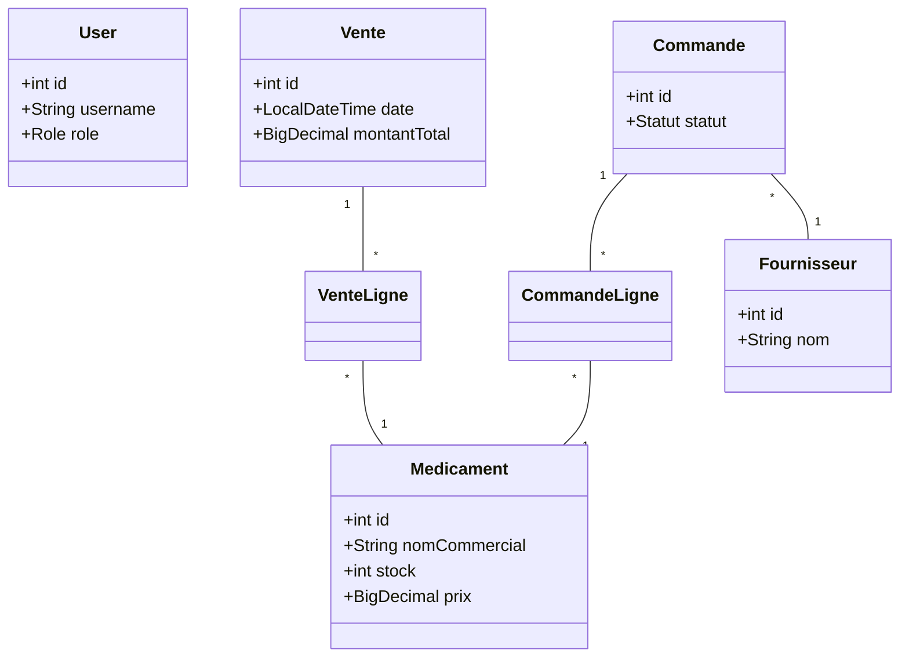

# Documentation Technique - SGPA Pharmacie

## 1. Présentation du projet
SGPA (Système de Gestion de Pharmacie Automatisé) est une application Java permettant d'informatiser la gestion quotidienne d'une pharmacie : médicaments, stocks, ventes, fournisseurs et commandes.

## 2. Architecture Logicielle
L'application suit l'architecture **MVC (Modèle-Vue-Contrôleur)** :
- **Model** : Entités métier (`Medicament`, `Vente`, `User`, etc.).
- **View** : Interfaces graphiques en FXML (`Login.fxml`, `Dashboard.fxml`, etc.).
- **Controller** : Logique applicative JavaFX reliant la vue et les services.
- **DAO (Data Access Object)** : Couche d'accès aux données PostgreSQL via JDBC et HikariCP.
- **Service** : Logique métier et gestion des transactions.

## 3. Technologies utilisées
- **Java 17+**
- **JavaFX** (Interface graphique)
- **PostgreSQL** (Local ou distant)
- **HikariCP** (Pool de connexions)
- **Maven** (Build et gestion des dépendances)

## 4. Diagrammes UML

### Diagramme de Classes (Simplifié)


### Cas d'Utilisation
```mermaid
usecaseDiagram
    actor Admin
    actor Vendeur

    Vendeur --> (Effectuer une vente)
    Vendeur --> (Consulter les alertes)

    Admin --> (Effectuer une vente)
    Admin --> (Gérer les médicaments)
    Admin --> (Gérer les fournisseurs)
    Admin --> (Gérer les commandes)
    Admin --> (Gérer les utilisateurs)
```

## 5. Sécurité
- Authentification obligatoire.
- Rôles **ADMIN** et **VENDEUR**.
- Les vendeurs ne peuvent pas modifier le stock de médicaments directement ou gérer les utilisateurs/fournisseurs.

## 6. Gestion des Transactions
Les ventes et réceptions de commandes sont transactionnelles. En cas d'erreur (ex: stock insuffisant détecté au dernier moment), l'ensemble de l'opération est annulée (Rollback) pour garantir l'intégrité des données.
